Doubly Circular Linked List
=============

# Node
    Double Linked List에서는 List의 앞 또는 뒤를 가르키는 포인터가 필요하다. 
  
  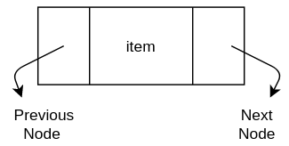

# 1. Insert
### 1) 리스트의 가장 앞에 삽입
#### 1. 리스트가 비었을 경우

##### (1) input으로 들어온 값을 가지는 새로운 노드를 만든다. (수정 요함)
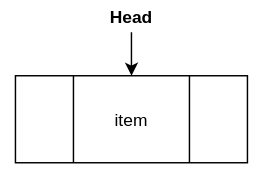

##### (2) previous node를 가르키는 포인터를 자신의 주소를 가르키도록 만든다.
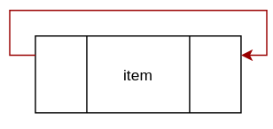

##### (3) next node를 가르키는 포인터를 자신의 주소를 가르키도록 만든다.
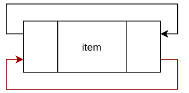

##### (4) head가 자신을 가르키도록 만든다.

   

#### 2. 리스트에 노드가 이미 생성되어 있는 경우

##### (1) 다음 그림과 같은 상황에서 새로운 노드를 삽입한다고 가정한다.
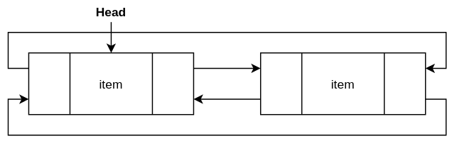

##### (2) item이 주어진 input값을 같는 새로운 노드를 생성하고, 생성된 노드의 next node를 가르키는 포인터가 head를 가르키도록 한다. head의 previous node를 가르키는 포인터가 생성된 노드를 가르키도록 한다.
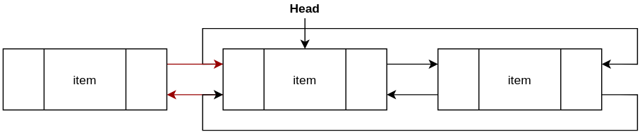

##### (3) head의 previous였던 노드의 next node를 생성한 노드로 설정하고, 생성한 노드의 previous node를 head의 previous였던 노드로 설정한다.
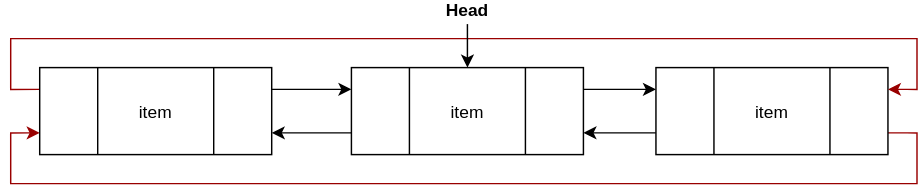

##### (4) head를 새로 생성한 노드로 지정한다.
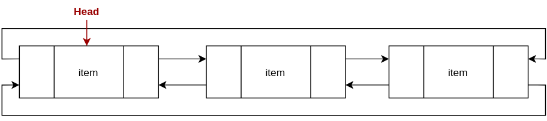

   

### 2) 두 node 사이에 삽입

##### (1) 다음과 같은 상황에서 새로운 노드를 삽입한다고 가정한다.
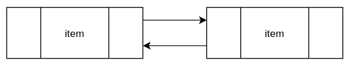

##### (2) 주어진 input을 item으로 갖는 노드를 생성하고, 생성한 노드의 previous, next node를 아래 그림과 같이 지정한다.
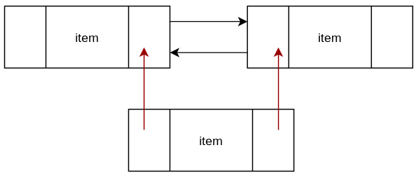

##### (3) 삽입될 자리 앞, 뒤의 노드의 previous, next node를 아래 그림과 같이 지정한다.
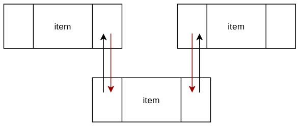

   

## 2. Delete
### 1) 리스트의 가장 앞 노드를 삭제

##### (1) 다음과 같은 상황에서 head가 가르키는 노드를 삭제한다고 가정한다.
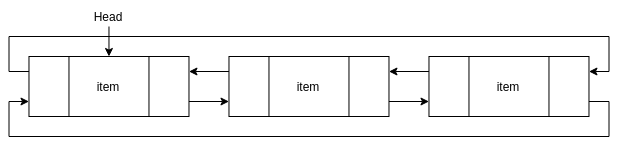

##### (2) head의 previous node의 next를 head의 next node로 지정하고, head의 next node의 previous node를 head의 previous node로 지정한다.
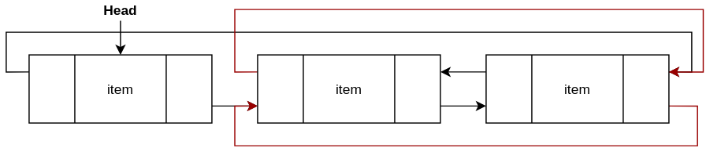

##### (3) head의 next node를 head로 지정한다.
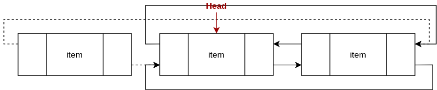

##### (4) garbage collector에 의해서 head였던 node가 삭제된다.
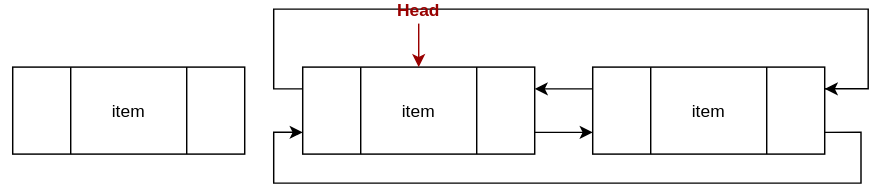

   

### 2) 두 node 사이에 있는 node를 삭제

##### (1) 다음 그림과 같은 상황에서 가운데 있는 노드를 삭제하려고 한다.
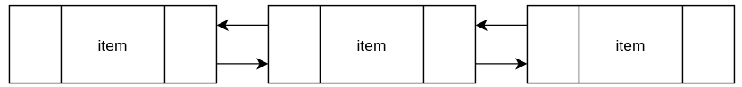

##### (2) 아래와 같이 노드를 연결해 준다.
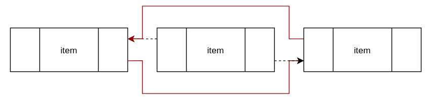

##### (3) garbage collector에 의해서 노드 삭제가 완료된다.
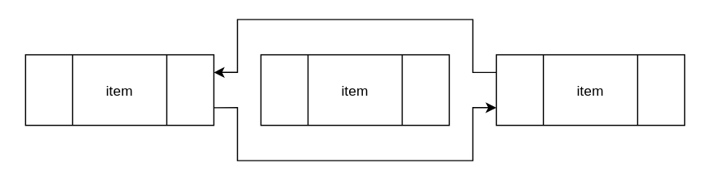

   

## 3. Search

##### (1) 새로운 노드 p를 생성하여 head를 가르키도록 한다. input으로 들어온 item과 비교를 한다.
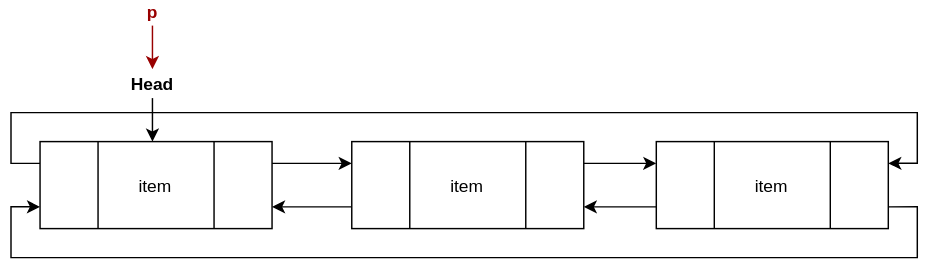

##### (2) p가 p의 next node로 이동하면서 input으로 들어온 item과의 비교를 계속한다.

